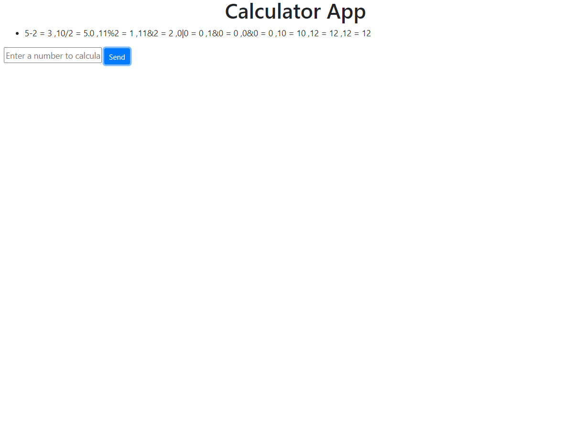

# Asynchronus calculator app
* Designed an web application to create an calculator using the Flask API,Python, HTML and Javascript

## Tools and Technologies Used
* Python
* HTML
* JavaScript

### OVERVIEW
* Entire application is designed in the Flask API and used HTML and Javascript in the fronend of the application 
* Run the application 
'''bash
   SET FLASK APP=main.py
'''

'''python
   python -m flask run
'''
* This will open the local port 5000 and will be show an calculator application
* User can enter the text in the dialouge prompt to get the calculation results 
* All the results from other user are show in the scrolling bar below the calculator app heading in the application
* The results are scrolled based on the information provided by users 

### RESULTS
* The results show top 10 calculations performed in the application only latest 10 calculations from different users are only prompted at any given point of time.

| |
